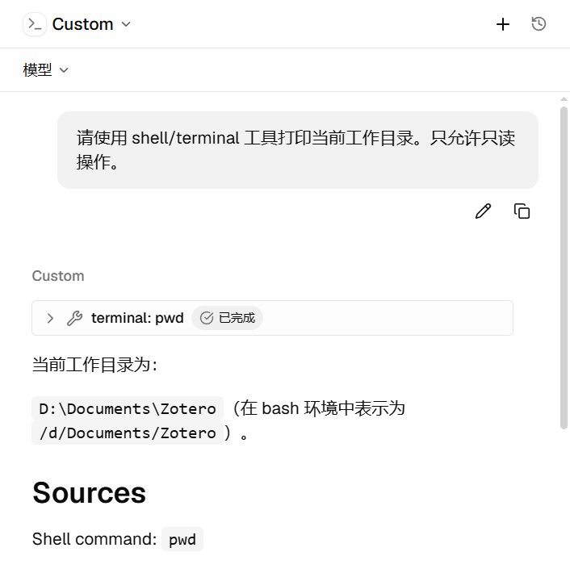
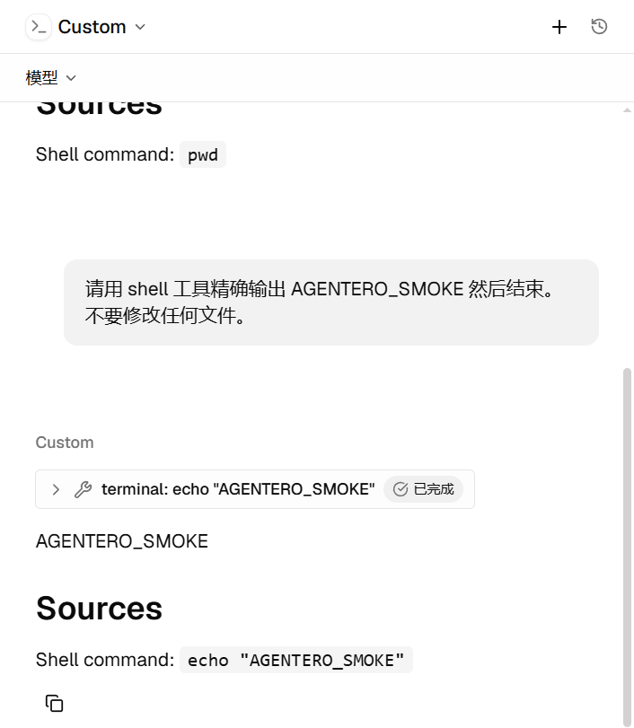

# Windows ACP 终端工具 Pending/Error：Hermes MSYS2 挂死与 Host 侧缺陷

**状态**：已修复（Host 侧缺陷已修；Hermes 自家 terminal 工具的挂死属上游问题——已提
[#103398](https://github.com/NousResearch/hermes-agent/issues/103398) + PR
[#103502](https://github.com/NousResearch/hermes-agent/pull/103502)，受影响机器以环境变量绕过 + local.py 热修过渡）
**影响面**：Windows → Agent 会话终端类工具调用（Pending 卡片 / Error 卡片 / kill·release 失效）→ `cargo test`（Windows 测试二进制无法启动，独立缺陷）
**相关代码**：

- `src-tauri/src/features/agent/acp/terminal.rs` — manager 锁粒度、EOF 等待、kill 通路、超时
- `src-tauri/src/features/agent/acp/client.rs` / `session/run.rs` / `service.rs` — `simplified_agent_cwd`（`\\?\` 扩展 cwd 规范化）、`.terminal(true)` 能力宣告（`session/run.rs` 的 `prepare_run_turn`）
- `src-tauri/build.rs` — Windows 测试二进制 Common-Controls v6 manifest
- 前端：`src/lib/agent/chat-state.ts`（`applyToolToLines` / `failIncompleteTools`）、`src/components/agent/hooks/use-agent-session-runtime.ts`
- 设计总览：[`../backend/agent.md`](../backend/agent.md)（ACP terminal 能力小节）、[`../test/release-checklist.md`](../test/release-checklist.md)（11.1.10 / 11.1.11）

---

## 1. 问题现象

Windows 上构建/安装的 Agentero 中，ACP Agent（内置 Hermes、自定义
`hermes.exe -p <profile> acp`）的终端类工具调用出现两种表现：

1. `terminal: pwd` 等卡片停留在 **Pending** 数分钟；
2. 卡片变为 **Error**，但对话中仍能看到正确输出（如工作目录），或由
   `python: import os` 兜底完成。

发布版在某些时点表现正常，源码构建持续复现，一度指向"源码回归"。

## 2. 排查结论：症状与缺陷分属三层

### 2.1 症状真因在 Hermes 上游（非 Agentero terminal 实现）

- Hermes 的 ACP 适配器（`acp_adapter/`）**不调用** ACP 客户端
  `terminal/create|output|wait_for_exit|kill|release`——"terminal: pwd" 卡片
  是其自家 `tools.terminal_tool`（本地持久 Git Bash）经 `session/update`
  转发的名字（`acp_adapter/tools.py:97-101` 的 `f"terminal: {cmd}"`）。
  因此 Agentero 的 `terminal/*` 实现是否正确，不影响该症状。
- 挂死点：`tools/environments/local.py` 的 `_find_bash()` → `_bash_starts()`
  探针。从 Hermes python 进程内 spawn 的 Git for Windows `bin\bash.exe`
  在 MSYS2 re-exec（`bin\..\usr\bin`）后死锁（0 CPU、永不退出），毫秒级
  探针命令挂满执行器 420s 超时。系统强制 ASLR 未启用（`ForceRelocateImages
  : NOTSET`），属 fork/spawn 死锁的另一变体，且天然间歇性——解释了
  "发布版某次成功、源码构建持续失败"的观感。
- 复现与证据：绕开 Agentero 的最小 ACP 客户端直连 Hermes 可完整复现
  （tool_call → 420s 静默 → failed → `execute_code` 0.17s 兜底成功）；
  Hermes `state.db` 同时记录 `timed out after 420.0s`。
- **已验证绕过**：`HERMES_GIT_BASH_PATH` 指向 `usr\bin\bash.exe`（跳过
  `bin\bash.exe` 包装层重执行）后 terminal 恢复（2/2 运行 exit 0，
  ~33s 含内部探测重试）。`MSYS=disable_pcon` 无效。

### 2.2 Host 侧真实缺陷（本轮修复）

Hermes 未触发它们，但对 Kimi Code 等真正委托 `terminal/*` 的 agent 是必修：

1. **manager 锁跨无限 await**：`src-tauri/src/features/agent/acp/terminal.rs` 的请求闭包
   `terminals.lock().await.<op>(…).await` 使任一 `wait_for_exit`/`output`
   挂起即阻塞同连接全部终端请求（含下一个 `create` 与 `kill`/`release`），
   规范推荐的"超时 → kill → output → release"自救配方必然死锁。
2. **`output()` 等待管道 EOF**（`2a45cdd5` 引入）：违反 ACP 规范
   "retrieves the current terminal output without waiting for the command
   to complete"；Windows 上孙进程继承句柄使 EOF 永不到来。
3. **`kill` 被 `wait()` 占用的 child 锁堵死**：`spawn_waiter` 持
   `child.lock()` 跨 `child.wait()`，`kill` 排在同一锁后，无法自救。
4. **短进程退出通知竞态**：旧实现先查状态，再订阅 `watch` 并等待下一次
   `changed()`；进程若恰在两步之间退出，终态会被新 receiver 视为已读，
   `wait_for_exit` 永久等待。修复后保留初始 receiver，以 `send_replace` 发布终态，
   并用 `wait_for(Option::is_some)` 先检查当前值。
5. **`\\?\` 扩展 cwd 传给 ACP 会话**：前端可能送入 canonicalize 后的
   `\\?\D:\…`；Hermes 等基于 MSYS2 的 shell 无法 `cd` 进 `\\?\` 路径，
   且子进程 POSIX cwd 初始化失败后 mktemp/cd 全部 ENOENT。本地 ACP 的
   run / warm / list / load 入口统一经 `simplified_agent_cwd` 规范化（list / load
   收敛在 `service.rs` 的 `agent_cwd_or_local`），这四个入口的终端默认 cwd 均复用
   同一结果；扩展 UNC 形式保持不变。
6. **ACP 分发循环被终端等待阻塞**（PR #474 审查补充）：协议库逐条等待
   handler 完成；仅释放 manager 锁仍不能让后续 `kill` 进入 handler。
   wait / kill / release 在分发时先获取或移除句柄，再通过 `connection.spawn`
   等待并响应，让同连接继续处理消息，任务生命周期仍由连接管理。

修复要点：manager 锁只保护句柄存取；`Child` 所有权移入单一 controller
任务，`kill` 经 mpsc 控制通道 + oneshot ack；reader 排空限时 250ms/个并
abort；`output` 只快照当前缓冲；终端默认 cwd 兜底为会话 cwd。

### 2.3 Windows `cargo test` 瘫痪（独立缺陷，本轮 `build.rs` 修复）

测试二进制启动即 `STATUS_ENTRYPOINT_NOT_FOUND`（`TaskDialogIndirect`）：
Tauri 栈静态导入该 comctl32 v6 专属函数，而 tauri-build 的 manifest 资源
经 embed-resource 只发 `cargo:rustc-link-arg-bins`（仅 bin 目标），测试
二进制没有 manifest，加载器落到 comctl32 v5。与运行时行为无关、纯启动
失败，`cargo check`/编译均正常，故极易误判为环境问题。
修复：`build.rs` 对 Windows MSVC 追加
`cargo::rustc-link-arg=/MANIFESTDEPENDENCY:…Common-Controls v6…`（bin 的
manifest 内容本就相同，合并无副作用；GNU 工具链排除）。

## 3. 前端状态同步（本轮修复）

- 迟到的 tool update 曾被丢弃（只处理"最后一条 streaming 行"）：
  `applyToolToLines` 按 `toolCallId` 回写所属回合，迟到的 completed/failed
  也能修正原卡片。
- 回合完成/失败/取消时，仍为 pending/in_progress 的卡片统一收敛为
  failed（`failIncompleteTools`），消灭永久 spinner；迟到终态仍可覆盖。
  PR #474 审查补充：已结束回合继续接收迟到内容与终态，但忽略 pending/in_progress
  状态，避免迟到进度重新激活 spinner；回归覆盖进度 → 完成 → 进度的乱序更新。

## 4. 验证

- Windows `cargo test --lib`：717 通过、10 ignored（4 个既有平台相关失败）；
  修复前测试二进制无法启动。
- 隔离 crate 全量终端测试 8/8（含"运行中 output 即时返回"、"wait 挂起时
  kill 可用"两个核心回归场景）。
- PR #474 审查新增协议层回归：同一 ACP 连接先发送 `wait_for_exit`，再发送
  output → kill → release，必须在长命令自然退出前完成；对象级测试无法覆盖
  串行分发循环被阻塞的问题。
- ACP 探针实测：修复后 terminal 恢复（见 2.1 绕过验证）。
- 前端 vitest 34/34；`tsc --noEmit` 干净。
- 真机端到端（安装版，自定义 ACP Agent / Hermes）：`terminal: pwd` 与
  `terminal: echo "AGENTERO_SMOKE"` 均"已完成"、输出正确（覆盖 PowerShell
  兜底路径）：

  
  

## 5. 教训与后续

- **用户可见症状 ≠ 本仓库缺陷**：先确认 agent 是否真的走 ACP 客户端
  委托（读 agent 源码/抓 wire），再动 Host 侧实现。
- **测试二进制的 Windows 资源问题在启动瞬间爆**，编译/检查全绿，
  排查时应优先看"进程是否启动"，而非测试断言。
- 后续跟踪：
  - Hermes 上游已提：[#103398](https://github.com/NousResearch/hermes-agent/issues/103398)
    （原始报告）+ [#103502](https://github.com/NousResearch/hermes-agent/pull/103502)
    （WSL 存根排除，open）；官方在途：[#83413](https://github.com/NousResearch/hermes-agent/pull/83413)
    （探针 stdin）+ [#103402](https://github.com/NousResearch/hermes-agent/pull/103402)
    （杀进程树，In Review）；分诊确认同机制上游单
    [#74982](https://github.com/NousResearch/hermes-agent/issues/74982)；
  - 三 PR 全部合并发版后：移除 `HERMES_GIT_BASH_PATH` 环境变量绕过 +
    `git checkout -- tools/environments/local.py` 还原本地热修；
  - 可选增强：自定义 Agent 表单暴露 env 编辑（后端 `AgentDescriptor.env`
    已支持，UI 未暴露），便于按 agent 注入此类环境变量。

## 6. Hermes 本地热修（第二层缺陷）

重测发现第二层：Git Bash 探针在冷启动竞态下失败时，`_find_bash()` 的
最后候选 `shutil.which("bash")` 会解析到 **System32 的 WSL bash 存根**
（进程轮询可捕获 `System32\bash.exe` + `wsl.exe` + `wslhost.exe` 同时
出现），WSL bash 自身探针能通过，于是快照脚本跑在 WSL 文件系统视图里——
`/c/`、`/d/` 不存在 → mktemp/cd 全部 ENOENT → Error。agent 的 python
兜底甚至会报告 `/mnt/d/Documents/Zotero`（WSL 挂载形式）。

受影响的 Hermes 安装（git clone 安装，v0.21.0 验证）需应用如下热修：
`tools/environments/local.py` 的 `which("bash")` 兜底排除系统目录下的
WSL bash 存根——路径经 `%SystemRoot%`（回退 `%WINDIR%`）解析并两侧
normcase 比较，非 `C:\Windows` 系统盘同样生效（硬编码 `C:\Windows`
会在非标准系统盘漏判）。探针全败时抛既有结构化错误
"Git Bash not found…"，而不是静默降级到 WSL。验证四种场景：
正常路径仍选中 Git Bash / 无 Git Bash 时抛清晰错误 / bin 与 usr\bin
两种布局均可 / 非 C 盘 SystemRoot 比较为真；应用后端到端探针 terminal
恢复（exit 0，~18s）。注意：`hermes` 自更新（git pull）会覆盖该热修，
需重打或等上游 [#103502](https://github.com/NousResearch/hermes-agent/pull/103502)
合并。
