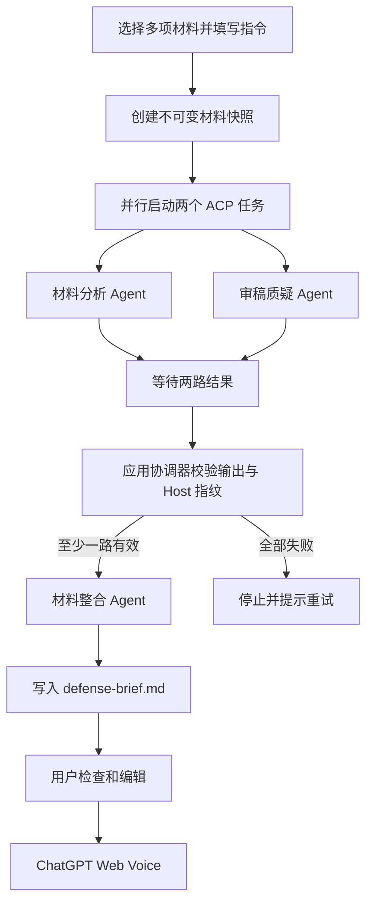

# 多 Agent 协同答辩准备 MVP

**状态**：Phase 0–2 MVP 已实现；Phase 3 本地评估工具已实现，真实论文质量评估待执行

**关联能力**：[ChatGPT Web Voice 答辩模式 MVP](chatgpt-web-voice-defense-mvp.md)

**关联 Issue**：[#237](https://github.com/poco-ai/Agentero/issues/237)

**范围**：会前多材料理解与答辩材料生成；不修改实时 Voice 传输协议

**实现位置**：`src/lib/voice-defense/preparation/`、
`src/components/agent/voice-defense-dialog.tsx`、
`src-tauri/src/features/agent/hidden_sessions.rs`、
`src-tauri/src/features/vault/host_fs.rs`

**自动化验证**：`test/voice-defense-preparation.test.ts`、
`test/background-tasks.test.ts`、`test/vault-host-fs.test.ts` 与 Rust Agent/Vault 测试。

**生命周期屏障**：前端维护 preparation runtime/Voice lease，Host 的
`AgentRunController` 另按 `voice_defense_preparation` workflow 追踪真实 ACP wrapper；
Voice 必须同时通过两层检查。

## 1. 决策摘要

答辩能力拆成两个完全独立的阶段：

1. **会前准备**：用户选择一个或多个文件/目录并填写答辩要求，多个本机 ACP Agent 分析完整材料包、核对证据并生成可编辑的答辩材料；允许耗时，可以取消和重试。
2. **实时答辩**：只保留 ChatGPT Web Voice，通过现有 WebRTC/DataChannel 直接完成提问和回答；不等待任何 ACP Agent。

首版采用固定的 fan-out/fan-in 工作流，不建设通用多 Agent 平台：

```text
用户选择的材料包 + 答辩要求
  ├─ 材料分析 Agent ─┐
  └─ 审稿质疑 Agent ─┼─ 材料整合 Agent ─ 用户检查 ─ ChatGPT Web Voice
```

核心约束：

- 多 Agent 只在开始语音答辩之前运行；
- 材料指纹未变时，用户可确认复用上次 brief，也可重新跑多 Agent；未准备不能进入 Voice；
- 答辩入口不依赖 Agent 聊天输入框的当前上下文开关；
- 进入 Voice 会话前，所有 ACP 子进程必须结束；
- Voice 每轮对话不依赖本地 Agent、检索或合并任务；
- Agent 之间不自由群聊，只交换结构化产物；
- Agentero 继续作为 BYOA ACP Client，不要求用户填写模型 API Key；
- 不覆盖论文、`NOTES.md` 或用户手写文件；
- 最终材料发送给 ChatGPT 前必须由用户检查并确认。

结构化输出不是“尽量覆盖”：论文分析必须包含九类主题，审稿质疑必须包含六类风险、
基础与高级难度，并为每题提供至少一个追问。缺少任一必填覆盖会产生 invalid attempt，
按节点重试策略处理，不会作为有效输入进入整合。

## 2. 背景与问题

早期 Voice MVP 只收集当前选区、Markdown 或论文 `NOTES.md`，通过一条普通用户消息把提示词和材料注入 ChatGPT Web Voice。该路径不能表达一次答辩涉及的多份论文、讲稿、实验数据和补充材料，也不能保证 Voice 已全面理解输入：

- 当前材料可能只是摘要或阅读笔记，不包含完整方法、实验和局限；
- 原始材料很长时，直接堆入一次提示词会稀释重点；
- Voice 模型优先实时性，不应同时承担完整论文阅读、证据核验和实时交互；
- 提示词是普通用户消息，不是受协议保证的 system instruction；
- 多轮通话期间再启动分析 Agent 会引入不确定延迟和失败依赖。

因此，本规划不把更多原文直接塞给 Voice，而是在会前生成一份经过角色分工、交叉检查和用户确认的 `defense-brief.md`。

## 3. 目标与非目标

### 3.1 目标

1. 让用户显式选择本次答辩所需的一项或多项材料，而不是隐式绑定当前论文。
2. 用不同任务视角减少单次总结遗漏，而不是让多个 Agent 重复做同一件事。
3. 让关键结论尽量带来源路径、章节、页码、图表或公式引用。
4. 保持 Voice 实时链路不变，不增加每轮问答延迟。
5. 保持 local-first：生成材料是 Vault 中可直接读取的 Markdown。
6. 继续复用任意 ACP-compatible Agent，避免绑定 LangChain、OpenAI API 或特定模型。
7. 首版实现简单、可理解，可以根据真实效果决定是否扩展。

### 3.2 非目标

- 通用 DAG/工作流编辑器；
- Agent 注册中心或动态 Agent 发现；
- Agent 间自由对话或自由委派；
- 多模型路由、模型投票或多数表决；
- 实时 RAG、向量数据库或每轮检索；
- 通话过程中运行后台分析 Agent；
- 自动评分、知识图谱或跨答辩长期画像；
- 云端调度、分布式 Worker 或企业审计平台；
- 替换现有 ChatGPT Web Voice Sidecar 和认证链路。

## 4. 权威开源架构参考

本设计借鉴成熟项目的协作语义，但不直接引入其 Python/云端运行时。

| 体系 | 采用的设计 | 本项目不采用的部分 |
|---|---|---|
| [Microsoft Agent Framework](https://github.com/microsoft/agent-framework) | 显式 Workflow、并发 fan-out/fan-in、checkpoint、human-in-the-loop | Python/.NET 运行时、云端托管和企业控制面 |
| [LangGraph](https://github.com/langchain-ai/langgraph) | 状态图、节点幂等、持久执行、interrupt/resume、子任务上下文隔离 | 在桌面应用中新增 LangGraph 运行时或服务 |
| [OpenAI Agents SDK](https://openai.github.io/openai-agents-python/multi_agent/) | 由 manager 保留最终回复权、代码编排、结构化输出、guardrail | OpenAI API 绑定、Agent handoff 接管用户会话 |
| [Magentic-One](https://www.microsoft.com/en-us/research/articles/magentic-one-a-generalist-multi-agent-system-for-solving-complex-tasks/) | Orchestrator、Task/Progress Ledger、停滞检测和定向重规划 | 开放式长期群聊、浏览器/终端自治团队 |
| [A2A](https://github.com/a2aproject/A2A) | Task/Artifact 分离、终态任务不可变、产物引用与版本关系 | 为本地 ACP Agent 新增 HTTP A2A 服务 |
| [ACP](https://github.com/agentclientprotocol/agent-client-protocol) | Agent 可替换、能力协商、独立 session、流式事件和权限请求 | 把 ACP 当作 Agent-Agent 编排协议 |

由此得到五条设计原则：

1. **外层确定、内层自治**：Agentero 用代码固定流程，Agent 只在自己的节点内推理。
2. **产物协作，不共享聊天历史**：下游读取上游结构化结果，不复制全部会话。
3. **任务不可变**：失败或补充分析创建新 attempt，不修改已经完成的节点结果。
4. **Host 强制约束**：并发、超时、重试、取消、路径和输出格式由应用控制。
5. **用户拥有最终决定**：只有用户确认后的材料才能进入 Voice。

## 5. 产品形态

### 5.1 用户入口

保持现有 Agent 面板麦克风入口，不新增独立多 Agent 工作台。打开弹窗后首先展示材料选择器：当前焦点文件或论文目录默认选中，用户可搜索并勾选多个 Vault 文件/目录、移除已选卡片，并填写本次答辩的文字要求与批注。

打开答辩弹窗后，根据材料状态显示：

| 状态 | 主操作 | 次操作 |
|---|---|---|
| 尚未选择材料 | 选择至少一项材料 | — |
| 已选择材料 | 准备答辩 | 编辑答辩要求 |
| 准备中 | 查看进度 / 取消 | 关闭弹窗后后台继续 |
| 准备成功 | 开始答辩 | 重新准备 |
| 准备失败 | 重试失败步骤 | — |
| 材料已变化 | 更新答辩材料 | — |

不存在未准备直接进入 Voice 的旁路。材料列表、文字指令和文件指纹均未变化时，准备页可提示「使用上次提纲」（需用户确认后加载该 run 的 `defense-brief.md`），或「重新准备」创建新的 preparation run。

### 5.2 准备过程

准备进度只显示用户能理解的阶段：

```text
正在分析所选材料
正在检查可能的质疑
正在整理答辩材料
```

不在产品界面暴露 DAG、节点 ID、ACP session 或 token。例外：委员的实时思考流与工具动作以装饰性低对比度背景呈现在准备页（仅内存、随 run 结束丢弃，不写入 manifest、artifact 或日志），让用户确认模型确实在工作。

准备任务可以在弹窗关闭后继续，通过现有后台任务区域展示进度；完成后发送应用内通知。任务始终绑定启动时的材料列表、文字指令和文件快照，用户之后切换页面不会改变正在运行的输入。

### 5.3 材料检查

准备完成后继续使用当前可编辑材料区，展示最终 `defense-brief.md`。用户可以修改、补充或删除内容。开始答辩时发送的是编辑后的版本，不是中间 Agent 产物。

材料不做静默字符截断。整合 Agent应主动提高信息密度，但这只是生成目标，不是应用侧硬限制。若上游拒绝实际超限请求，显示真实错误。

### 5.4 实时答辩

点击“开始答辩”后：

1. 确认本次 preparation run 已完成、用户已检查材料；
2. 确认所有准备阶段 ACP runtime 已停止；
3. 按当前逻辑申请麦克风并建立 WebRTC；
4. 将用户确认后的材料一次性注入 Voice；
5. 后续语音轮次不调用任何 ACP Agent。

多 Agent 全部失败时停止流程，用户必须重试或重新选择材料，不能直接进入 Voice。

## 6. MVP 协同流程



### 6.1 多材料快照

启动时固定本次任务的输入范围：

- 用户勾选的一个或多个文件/目录；
- 用户填写的答辩要求与批注；
- 属于所选材料范围的当前选区及其来源/page；
- Markdown、文本、PDF、LaTeX、BibTeX、图片和实验数据；
- 当前论文属于所选范围时才附加 Catalog metadata；
- 输入文件的路径、修改时间和内容 hash。

优先级不是“只选一个来源”，而是为 Agent 提供来源清单并说明可靠性：

```text
论文原文/LaTeX/PAPER.md > 图表与实验数据 > NOTES.md > 用户选区
```

如果只有 `NOTES.md` 可读，应在最终材料中标记来源受限，不能声称完成了全文核验。

### 6.2 材料分析 Agent

职责：把全部所选材料视为同一个证据包，建立完整结构和主张地图；材料之间冲突时显式指出，某类信息不存在时不得编造。

必须覆盖：

- 研究问题与动机；
- 核心贡献；
- 方法流程和关键假设；
- 数据集、基线、指标和实验设置；
- 主要实验结果；
- 消融、鲁棒性或误差分析；
- 局限与未来工作；
- 关键术语、公式、图表和可引用位置。

不得输出泛化的“论文看起来很好”等评价；无法从来源确认的内容必须标记 `unverified`。

### 6.3 审稿质疑 Agent

职责：站在严格答辩委员和审稿人的角度形成问题集合。

必须覆盖：

- 动机是否充分；
- 新颖性与相关工作的差异；
- 方法假设是否成立；
- 实验设计、公平性和统计有效性；
- 结论是否超出证据；
- 失败案例、边界条件和复现成本；
- 从基础到困难的答辩问题；
- 每个问题的追问方向和参考答案要点。

该 Agent 不读取论文分析 Agent 的完整对话，避免被其结论锚定；两者只共享同一个不可变输入快照。

### 6.4 材料整合（已改为本地确定性合成）

> **实现变更（2026-08）**：整合步骤不再是第三个 ACP Agent。分析与质疑两个 Worker 的产物本就经过 Host 结构化校验（证据路径、主题/类别覆盖、schema），把它们渲染成 brief 是格式化工作而非推理工作。现由 `local-synthesis.ts` 本地模板合成：研究地图（九主题 + 证据位置）、委员质疑与应答准备（按类别/难度 + 追问 + 应答要点 + 证据）、引用来源汇总；产物仍通过与磁盘读取一致的 `parseDefenseStructuredOutput("synthesis", …)` 校验后写入 artifact 与 brief。收益：每次准备减少一整轮 LLM 往返（原先最慢的一步）、模板不会引入校验产物之外的内容；三阶段 UI、manifest 状态机、恢复与 partial 语义均不变。

原整合规则（模板实现继续遵守）：

- 先保留事实和证据，再保留评价；
- 冲突内容并列展示，不用多数投票消除；
- 无来源结论必须删除或标记（渲染 `unverified` 标记）；
- 去除重复背景和大段原文复述；
- 保留页码、章节、图表或文件路径；
- 生成问题时同时给出考察点和证据位置；
- 不生成供 Voice 朗读的长篇开场白；
- 不修改原论文或 `NOTES.md`。

## 7. 产物与协作协议

### 7.1 Task Envelope

每个节点接收显式任务，不依赖共享对话记忆：

```ts
type DefenseTask = {
  schemaVersion: 1;
  runId: string;
  taskId: string;
  attempt: number;
  role: "paper-analysis" | "adversarial-review" | "synthesis";
  objective: string;
  paperSnapshot: PaperSnapshot;
  inputArtifacts: ArtifactRef[];
  outputKind: DefenseArtifactKind;
  language: "en" | "zh-CN";
};

type PaperSnapshot = {
  // `paperPath` 与 `paperSnapshot` 是兼容既有 manifest 的内部名称；
  // 新流程的事实输入是 materials[]。
  paperPath: string;
  materials: Array<{
    path: string;
    kind: "file" | "directory";
    title?: string;
  }>;
  instruction: string;
  selections: PaperSelectionSnapshot[];
  sources: PaperSnapshotSource[];
  snapshotSha256: string;
};
```

### 7.2 Artifact Envelope

```ts
type DefenseArtifact = {
  schemaVersion: 1;
  artifactId: string;
  runId: string;
  taskId: string;
  attempt: number;
  kind: "paper-analysis" | "review" | "defense-brief";
  producer: string;
  contentPath: string;
  contentSha256: string;
  sources: EvidenceRef[];
  status: "valid" | "partial" | "invalid";
  warnings: string[];
  createdAt: string;
};
```

### 7.3 Evidence Reference

```ts
type EvidenceRef = {
  path: string;
  page?: number;
  section?: string;
  figure?: string;
  quote?: string;
  confidence: "high" | "medium" | "low";
};
```

应用协调器校验格式、文件边界、引用完整性与 artifact hash；大文件指纹和原子写入由 Host 执行。Agent 的自报 confidence 不被当成事实。首版不单独启动证据核查 Agent，材料整合 Agent承担轻量冲突和引用检查；后续效果不足时再拆出专门节点。

## 8. 状态与恢复

### 8.1 Run 状态

```text
created
→ snapshotting
→ analyzing
→ synthesizing
→ awaiting_review
→ ready
→ completed
```

异常终态：

```text
failed / cancelled
```

节点状态：

```text
pending / running / succeeded / failed / cancelled / skipped
```

### 8.2 首版恢复策略

- 任务完成后立即写入 manifest 和产物；
- 已成功节点不因另一个节点失败而丢弃；
- 单个分析节点最多自动重试一次；
- 两个分析节点全部失败时停止，不启动整合；
- 只有一路成功时允许整合，但最终材料必须显示“部分分析”；
- 应用重启后读取 manifest，允许从未完成节点重新开始；
- 不依赖 ACP provider 支持 `session/resume`；无法恢复 session 时用相同快照创建新 attempt；
- 输入 hash 改变后旧材料标记为 stale，不自动覆盖。

首版不实现动态重规划和多轮自我修复。Magentic-One 风格的 Progress Ledger 只保留为后续扩展点。

## 9. 本地存储

建议保存到 Vault：

```text
voice-defense/preparations/<run-id>/
├── manifest.json
├── artifacts/
│   ├── paper-analysis.json
│   ├── adversarial-review.json
│   └── synthesis.json
└── defense-brief.md
```

约束：

- `defense-brief.md` 是用户可见和可编辑的最终事实来源；
- JSON 只保存结构化产物、状态、来源和警告，不保存模型思维链；
- Host 通过临时文件 + 原子 rename 写 manifest，避免崩溃后留下半个 JSON；
- 重试创建新的 attempt 记录，不覆盖旧 attempt；
- 删除任务采用普通文件管理能力，不在准备流程中自动清理用户可见材料；
- 转写继续写现有 `voice-defense/`，并在正文中链接本次 `defense-brief.md`。

## 10. 技术架构

### 10.1 首版

首版不实现通用 Workflow Engine，只增加领域内固定协调器：

```text
React VoiceDefenseDialog
       │
       ├─ DefensePreparationCoordinator
       │    ├─ snapshotPaper()
       │    ├─ Promise.allSettled([analysis, review])
       │    ├─ validateArtifacts()
       │    └─ synthesizeBrief()
       │
       ├─ existing runOnce / ACP events
       └─ existing VoiceDefenseClient
```

建议模块：

```text
src/lib/voice-defense/preparation/
├── coordinator.ts
├── snapshot.ts
├── prompts.ts
├── schema.ts
├── storage.ts
└── state.ts
```

Host 仅补足后台 session 隔离、结果收集和取消所需能力，不创建新的 Python Sidecar。

### 10.2 后续演进

当出现跨窗口恢复、更多并行节点或复用需求后，再将编排下沉到 Rust Host：

```text
src-tauri/src/features/defense/
├── supervisor.rs
├── workflow.rs
├── scheduler.rs
├── checkpoint.rs
├── artifacts.rs
└── commands.rs
```

最终 Host Supervisor 负责节点依赖、并发、重试、取消和 checkpoint；ACP 仍只负责执行单个 Worker。不得把 ACP 扩展成私有 Agent-Agent 消息总线。

### 10.3 现有能力复用

- ACP 短生命周期 runner：[后端 Agent](../backend/agent.md)；
- 前端 `runOnce`、runtime session 事件和取消能力；
- `paper-reader` 的隐藏后台 workflow 模式；
- 后台任务进度与取消；
- 当前 Voice 登录、Sidecar、WebRTC、字幕和转写；
- Vault 安全路径、文件写入和原子内容更新能力；
- Vault 文件树、所选材料范围内选区和 Host 文件指纹能力。

`hideFromChatHistory` 的 Host 隔离已补齐：后台运行在完成事件前把
`(agentId, cwd/vault, providerSessionId)` 写入本地 SQLite 索引，
`agent_list_sessions` 按相同作用域过滤，跨应用重启仍有效。后续准备任务必须继续
为每个 child run 设置该标记。

## 11. 并发与资源生命周期

首版固定：

- 分析并发上限：2；
- 整合并发：1；
- 单节点自动重试：1 次；
- 同一主材料同时只允许一个 active preparation run；
- 不同材料包的任务进入同一 `voice-defense-preparation` 后台任务队列；
- 后台 semaphore 等待接受协调器的 `AbortSignal`，排队任务取消后不会执行 worker；
- 用户取消时取消全部 child runtime；
- 节点完成后立即关闭对应 ACP 进程；
- 进入 Voice 前必须满足 active ACP child count = 0；
- Voice 还必须通过 Host `agent_workflow_is_active=false` 屏障，覆盖 WebView 重载后的状态丢失；
- Voice 通话中只允许现有 `agentero-voice-sidecar` 存活。

并发上限不能复用通用 `other` semaphore，避免与导入、解析或其它后台任务相互阻塞。

## 12. Voice 流畅性约束

本功能不能改变实时语音关键路径：

```text
麦克风 → WebRTC → ChatGPT Web Voice → 远端音频
```

必须满足：

1. 点击“开始答辩”后不再调用 ACP；
2. Voice `connect()` 不等待准备任务、磁盘分析或模型推理；
3. 通话期间不进行自动摘要、检索、合并或评分；
4. 首个问题和后续问题都由同一个 Voice 会话直接产生；
5. preparation 完成后才允许调用现有 Voice 链路；
6. 以当前 Voice MVP 为基线，新增功能不能造成可归因于 Agentero 的每轮延迟。

可以保证的是多 Agent 不进入通话依赖链。不能保证的外部因素包括网络质量、ChatGPT 服务状态、账号限制和非官方 Web Voice 接口变化。

## 13. 权限、安全与隐私

- 每个 Worker 的任务信封只列出用户选择的材料快照、文字指令和属于材料范围的选区；ACP 在 Host 创建的只读快照 workspace 中运行，输出引用由应用做硬边界校验；
- 不自动读取用户所选文件或目录范围外的 Vault 文件；
- 后台任务使用 `restricted` 权限，不启用 `autoApprove`；
- Worker 不直接写论文目录，产物由 Agentero 校验后写入指定 preparation 目录；
- 命令执行、外部网络访问和论文目录修改继续经过 ACP 权限桥；
- 用户确认前，准备材料不会发送给 ChatGPT Web Voice；
- Agent 输出中的文件路径必须经过 Vault 边界检查；
- 日志和 manifest 不记录 token、系统凭证或模型思维链；
- 云端 tracing 默认禁用，运行记录保存在本地。

## 14. 失败处理

| 故障 | 行为 |
|---|---|
| 一个分析 Agent 失败 | 自动重试一次；仍失败则允许使用另一路生成部分材料 |
| 两个分析 Agent 都失败 | 停止整合，提示重试；禁止进入 Voice |
| 输出无法解析 | 保留原始输出用于诊断，按同一节点新建 attempt 重试 |
| 用户取消 | 取消全部 runtime，不删除已成功产物 |
| 应用退出 | 停止 child runtime；下次启动从 manifest 恢复可重试状态 |
| 任一所选材料或指令变化 | 标记材料 stale，不自动重写旧 brief |
| 整合失败 | 保留两路分析结果，允许只重试整合 |
| Voice 创建失败 | 保留准备材料，按现有 Voice 错误路径处理 |
| 上游拒绝材料长度 | 显示真实错误，不在本地静默截断 |

## 15. 观测与质量评价

每个 run/node/attempt 在本地记录：

- 开始、结束时间和状态；
- Agent、模型和 provider session ID；
- 输入快照 hash；
- 输出 artifact ID/hash；
- token/usage（provider 提供时）；
- stop reason、错误码和重试原因；
- 是否生成部分材料；
- 用户是否编辑、采用或重新准备。

不记录隐藏推理内容。首版不上传这些数据。

质量评估使用固定论文样本集，人工检查：

- 研究问题、方法、实验、结论和局限的覆盖率；
- 带来源主张的证据准确率；
- 无依据结论比例；
- 生成问题的区分度与可回答性；
- 用户对最终 brief 的修改比例；
- 准备完成率、取消率和失败率；
- Voice 首问与后续轮次延迟相对现有基线是否变化。

不能只用“Agent 数量”或“输出长度”评价效果。

## 16. 实施阶段

### Phase 0：前置修正

- [x] 验证并补齐 `hideFromChatHistory` 的 Host 行为；
- [x] 后台 session 与普通 Agent 历史隔离；
- [x] 确认每个 child runtime 可独立取消，并可在终态后用 `agent_run_is_active` 等待 Host wrapper 完成清理；
- [x] 为 preparation 定义独立后台任务 kind 和并发上限；
- [x] 增加 Host-owned 本地/远端文件指纹与原子文本写入接口，PDF bytes 不跨 WebView。

### Phase 1：单 Agent 基线

- [x] 生成带路径、mtime、size、SHA-256、材料清单和用户指令的多材料快照，并在阶段边界重验；
- [x] 材料分析节点独立生成可复用的结构化 baseline artifact；
- [x] 保存 `manifest.json`、attempt artifact 和 `defense-brief.md`；
- [x] 接入现有答辩弹窗的检查与开始流程；
- [x] 记录节点耗时、状态、usage（provider 提供时）与用户编辑/采用信息；固定论文集的人工质量基线归入 Phase 3。

这一步用于证明完整材料读取和结构本身有效，避免把多 Agent 收益与基础读取问题混在一起。

### Phase 2：最小多 Agent

- [x] 并行运行材料分析和审稿质疑；
- [x] 使用 `Promise.allSettled` 支持部分成功；
- [x] 增加一次材料整合，并在合成前回读、校验 schema 与 hash；
- [x] 增加取消、单节点自动/手动重试、重启恢复和 stale 检测；
- [x] 强制论文分析九类主题和审稿六类风险/难度/追问的结构化覆盖；
- [x] 排队等待可取消，Voice 使用 token lease 与 preparation 双向互斥；
- [x] 前端 child 状态和 Host workflow 屏障共同确认所有 ACP runtime 在 Voice 前退出。
- [x] 增加多文件/目录勾选、已选材料卡片和文字指令；未准备不可进入 Voice。材料指纹未变时允许用户确认复用上次 brief。
- [x] 会后隐藏 ACP 评价（结束页显式触发，不阻塞结束；产物 `voice-defense/<stem>-review.md`）。
- [x] 同材料包历史场次：转写 YAML frontmatter，准备页列出匹配场次。

### Phase 3：质量闭环

- [x] 增加轻量冲突、证据路径、artifact 完整性和用户确认校验；
- [x] 增加固定论文集人工评分模板与本地汇总工具（见 [质量评估](voice-defense-quality-evaluation.md)）；
- [ ] 用固定论文集对比单 Agent artifact 与多 Agent brief；
- [ ] 根据结果决定是否拆出独立证据核查 Agent；
- [ ] 只有出现真实跨窗口恢复需求时才把协调器迁入 Rust Host。

### 暂不排期

- 实时检索和下一问建议；
- 动态角色选择；
- 跨论文复用和历史趋势；
- 通用 Workflow Engine。

## 17. 测试计划

### 17.1 单元测试

- 快照来源收集、路径边界和 hash；
- 多材料去重、文件/目录混合输入和用户指令指纹；
- 结构化产物解析和 schema 校验；
- 两路成功、一路成功、全部失败；
- 单节点重试和 attempt 不可变；
- stale 检测；
- brief 不做应用侧截断；
- manifest 原子写入和恢复。

### 17.2 集成测试

- 使用 fake ACP event stream 验证并行、完成、失败和取消；
- 并发运行数始终不超过 2；
- 后台 session 不进入 Agent 历史；
- 关闭弹窗后任务继续，取消后所有 child runtime 结束；
- 整合只读取已校验的 artifact；
- 任一材料或指令变化后旧 brief 标记 stale；
- Voice 启动时 active ACP child count 为 0。
- WebView 内存状态丢失时，Host workflow 屏障仍阻止 Voice；旧 Voice 关闭回调不能释放新 lease。

### 17.3 UI 验证

- 无材料、单/多材料选择、准备中、部分成功、失败、ready、stale 状态；
- 未准备、全部失败或 stale 时均不能进入 Voice；
- 用户可以编辑最终 brief；
- 错误使用 `notifyError`，不在 header 常驻错误条；
- 所有新增文案经 i18n，图标按钮有可访问名称和 Tooltip；
- 桌面窄宽度下进度、操作和材料编辑区不重叠。

### 17.4 Voice 回归

- 准备成功后可建立 WebRTC、收到首问并多轮交互；
- 通话期间没有 ACP 准备进程；
- 静音、打断、结束、异常保存和 Sidecar 回收不变；
- 每次重新打开答辩入口回到材料选择，新答辩不会复用旧 brief 跳过 preparation。

## 18. 风险与取舍

| 风险 | 影响 | 控制 |
|---|---|---|
| 同一个模型扮演多个角色，认知并不独立 | 多 Agent 可能只是重复生成 | 使用不同目标和输出 schema，以覆盖率和证据准确率验证收益 |
| 多个 ACP 进程占用内存 | 低配设备准备阶段卡顿 | 并发固定为 2，节点结束立即退出 |
| provider 不支持可靠结构化输出 | JSON 解析失败 | 明确模板、应用 schema 校验、Host 原子写入、保留原始输出并最多重试一次 |
| provider session 污染普通历史 | 用户看到大量后台会话 | Phase 0 实现隐藏 session 持久过滤 |
| 材料来源不完整 | 产生“已完整理解”的错误印象 | 快照记录来源，最终 brief 显示受限来源警告 |
| Agent 生成无依据主张 | Voice 基于错误材料提问 | 强制证据引用、整合校验、用户确认 |
| 准备耗时过长 | 用户放弃功能 | 后台运行、允许复用文件解析/指纹缓存，但每次仍运行 Agent |
| 架构逐渐变成通用平台 | 开发成本失控 | 固定领域流程，达到明确证据后才增加节点或下沉 Host |
| ChatGPT Web Voice 接口变化 | 实时答辩失败 | 与准备阶段解耦，保留材料和现有错误回收 |

## 19. 验收标准

### 功能

1. 用户可勾选一个或多个文件/目录并填写答辩要求；当前焦点材料默认选中但不依赖 Agent 输入框上下文。
2. 两个分析任务能够并行运行，结果经一次整合生成可编辑 brief。
3. 一个节点失败不会丢失另一个节点结果；全部失败不会生成伪成功材料。
4. 生成材料包含来源信息，并明确标记未验证内容和部分成功状态。
5. 用户确认后的材料可进入现有 ChatGPT Web Voice 流程。

### 流畅性

1. 开始 Voice 前所有准备 ACP runtime 已停止。
2. Voice 每轮对话不触发 ACP、检索、摘要或合并任务。
3. 未完成本次 preparation run 时不能进入 Voice。
4. Voice 首问和后续交互没有由多 Agent 引入的额外等待节点。

### 工程

1. 不引入 LangGraph、Microsoft Agent Framework、CrewAI 或新的 Python runtime。
2. 不增加 API Key 配置，不改变 BYOA 边界。
3. 不覆盖用户论文、`NOTES.md` 或已有答辩材料。
4. 后台 session 不污染普通 Agent 历史。
5. 任务可取消，应用重启后已有产物可识别和重试。
6. 新增 UI 文案完成中英文 i18n，并通过必要的类型、测试、lint 和 UI 验证。

## 20. Go / No-Go 判断

Phase 2 完成后，以单 Agent 基线为对照：

满足以下条件才继续增加证据核查或会后评价 Agent：

- 方法、实验和局限覆盖率有可重复提升；
- 无依据结论没有明显增加；
- 用户对 brief 的大幅重写比例下降；
- 准备成功率和等待时间可接受；
- Voice 通话延迟相对基线不变。

如果多 Agent 只增加耗时和重复内容，应保留单 Agent 准备模式，不继续扩展协同节点。
